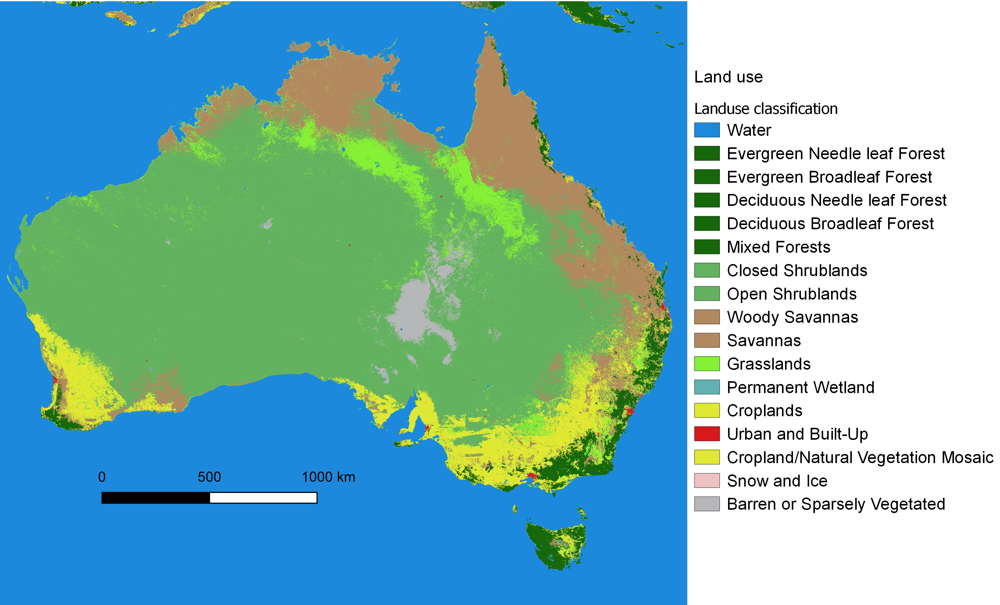
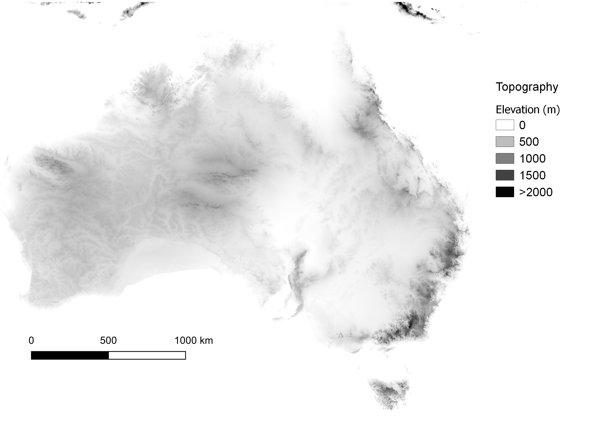
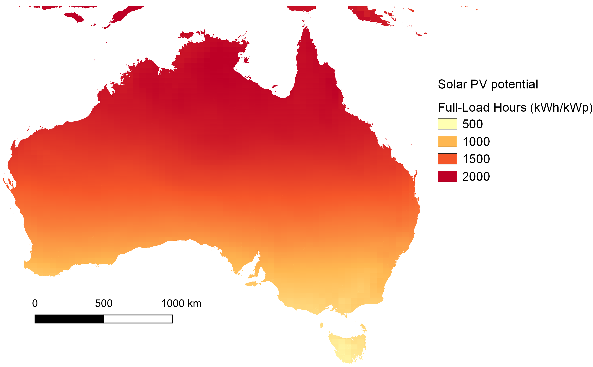
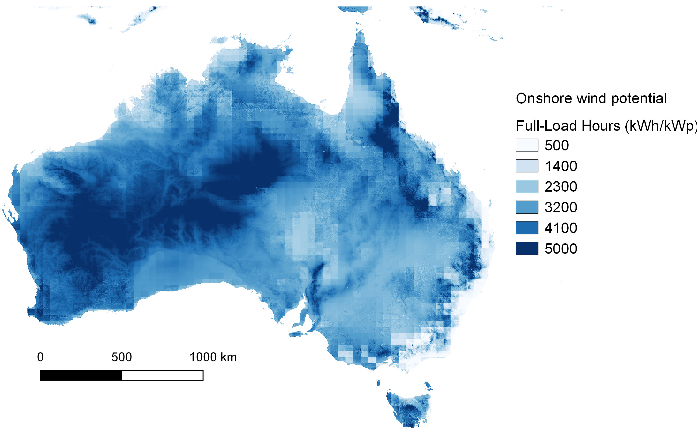
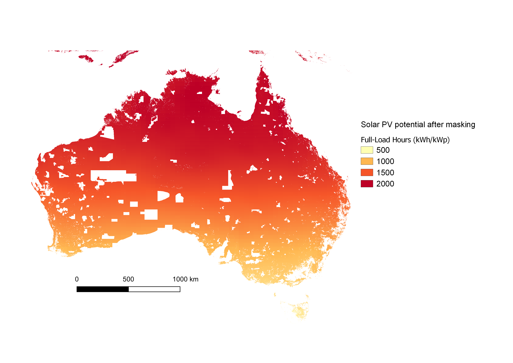
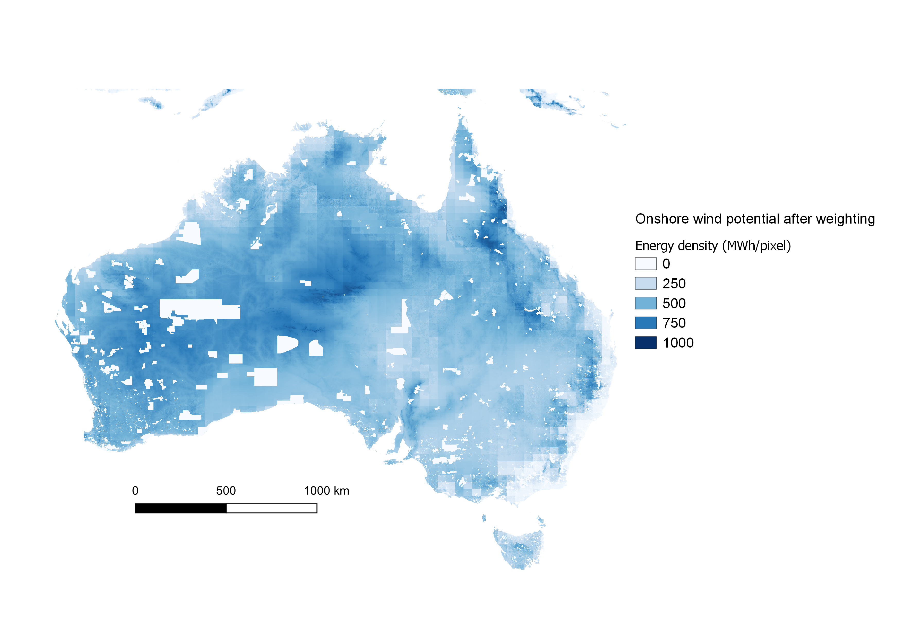
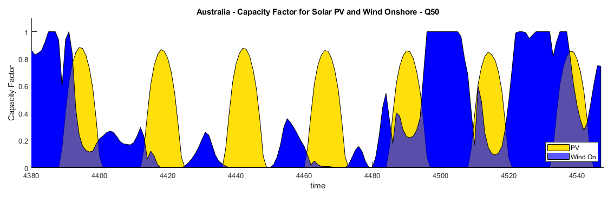
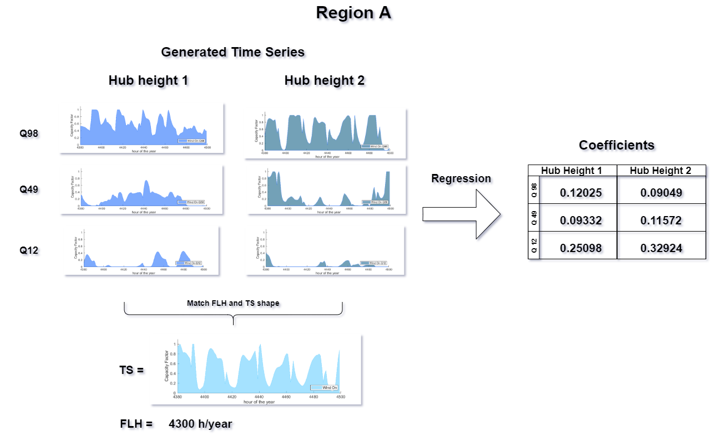
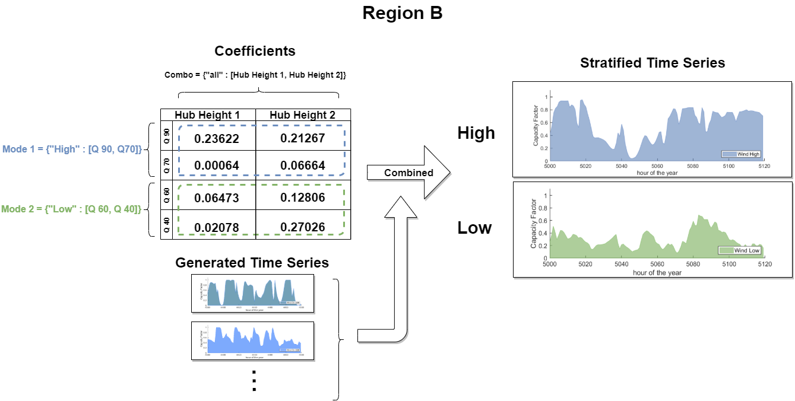

User manual
===========

Installation
------------

.. NOTE:: We assume that you are familiar with `git <https://git-scm.com/downloads>`_ and `conda <https://docs.conda.io/projects/conda/en/latest/user-guide/install/download.html>`_.

First, clone the git repository in a directory of your choice using a Command Prompt window::

	$ ~\directory-of-my-choice> git clone https://github.com/tum-ens/pyGRETA.git

We recommend using conda and installing the environment from the file ``pyGRETA.yml`` that you can find in the repository. In the Command Prompt window, type::

	$ cd pyGRETA\env\
	$ conda env create -f pyGRETA.yml

Then activate the environment::

	$ conda activate pyGRETA

In the folder ``code``, you will find multiple files:

.. tabularcolumns::
	|p{3.7cm}|p{9cm}|

+---------------------------------------+----------------------------------------------------------------------------------+
| File                                  | Description                                                                      |
+=======================================+==================================================================================+
| config.py                             | used for configuration, see below.                                               |
+---------------------------------------+----------------------------------------------------------------------------------+
| runme.py                              | main file, which will be run later using ``python runme.py``.                    |
+---------------------------------------+----------------------------------------------------------------------------------+
| lib\\initialization.py                | used for initialization.                                                         |
+---------------------------------------+----------------------------------------------------------------------------------+
| lib\\input_maps.py                    | used to generate input maps for the scope.                                       |
+---------------------------------------+----------------------------------------------------------------------------------+
| lib\\potential.py                     | contains functions related to the potential estimation.                          |
+---------------------------------------+----------------------------------------------------------------------------------+
| lib\\time_series.py                   | contains functions related to the generation of time series.                     |
+---------------------------------------+----------------------------------------------------------------------------------+
| lib\\regression.py                    | contains functions related to the regression.                                    |
+---------------------------------------+----------------------------------------------------------------------------------+
| lib\\spatial_functions.py             | contains helping functions related to maps, coordinates and indices.             |
+---------------------------------------+----------------------------------------------------------------------------------+
| lib\\physical_models.py               | contains helping functions for the physical/technological modeling.              |
+---------------------------------------+----------------------------------------------------------------------------------+
| lib\\correction_functions.py          | contains helping functions for data correction/cleaning.                         |
+---------------------------------------+----------------------------------------------------------------------------------+
| lib\\util.py                          | contains minor helping functions and the necessary python libraries to imported. |
+---------------------------------------+----------------------------------------------------------------------------------+

config.py                                                                                           
---------
This file contains the user preferences, the links to the input files, and the paths where the outputs should be saved.
The paths are initialized in a way that follows a particular folder hierarchy. However, you can change the hierarchy as you wish.

.. toctree::
   :maxdepth: 3
   
   source/config
   
runme.py
--------
``runme.py`` calls the main functions of the code:

.. literalinclude:: ../code/runme.py
   :language: python
   :linenos:
   :emphasize-lines: 18,28-31,34-36,42,45

Recommended input sources
-------------------------
For a list of GIS data sources, check this `wikipedia article <https://en.wikipedia.org/wiki/List_of_GIS_data_sources>`_.

Weather data from MERRA-2
^^^^^^^^^^^^^^^^^^^^^^^^^^
The most important  inputs within this model are the weather time series.
These are taken from the Modern-Era Retrospective Analysis for Research and Applications, version 2 (MERRA-2),
which is the latest atmospheric reanalysis of the modern satellite era produced by NASA's Global Modeling and
Assimilation Office (GMAO) :cite:`Gelaro.2017`. The parameters taken from MERRA-2 are:

* Global Horizontal Irradiance (*GHI*): Downward shortwave radiation received by a surface horizontal to the ground
  (*SWGDN* in MERRA-2 nomenclature).
* Top of the Atmosphere Irradiance (*TOA*): Downward shortwave radiation at the top of the atmosphere
  (*SWTDN* in MERRA-2 nomenclature).
* Air temperature 2 meters above the ground (*T2M*).
* Northward wind velocity at 50 meters (*V50M*).
* Eastward wind velocity at 50 meters (*U50M*).

The *GHI* and *TOA* data are time-averaged hourly values given in W/m while *T2M* data are instantaneous
values in Kelvin. *V50M* and *U50M* are instantaneous hourly values given in m/s.

The spatial arrangement of the data consists of a global horizontal grid structure with a resolution of 576 points in
the longitudinal direction and 361 points in the latitudinal direction, resulting in pixels of 5/8° longitude 
and 1/2° latitude :cite:`MERRA2.`.

It is possible to download MERRA-2 dataset for the whole globe or just for a subset of your region of interest.
Depending on the *MERRA_coverage* parameter in config.py, the script can accept both datasets. Note that downloading 
the coverage for the whole globe is easier but will require a significant amount of space on your drive (coverage 
of the whole globe requires 13.6 Gb for one year).

In both cases, please follow these instructions to download the MERRA-2 dataset:

1. In order to download MERRA-2 data using the FTP server, you first need to create an Eathdata account (more on that on their `website <https://disc.gsfc.nasa.gov/data-access>`_).
2. Navigate to the link for the FTP sever `here <https://disc.gsfc.nasa.gov/daac-bin/FTPSubset2.pl>`_.
3. In *Data Product*, choose tavg1_2d_slv_NX and select the *Parameters* T2M, U50M, V50M to downaload the temperature and the wind speed datasets.
4. In *Spatial Search*, enter the coordinates of the bounding box around your region of interest or leave the default values for the whole globe. 
   To avoid problems at the edge of the MERRA-2 cells, use the following set of formulas:
   
   .. math::
     \begin{align*}
           minLat &= \left\lfloor\dfrac{s+0.25}{0.5}\right\rfloor \cdot 0.5 - \epsilon  \\
           maxLat &= \left\lceil\dfrac{n-0.25}{0.5}\right\rceil \cdot 0.5 + \epsilon \\
           minLon &= \left\lfloor\dfrac{w+0.3125}{0.625}\right\rfloor \cdot 0.625 - \epsilon \\
           maxLon &= \left\lceil\dfrac{e-0.3125}{0.625}\right\rceil \cdot 0.625 + \epsilon
     \end{align*}
	
   where *[s n w e]* are the southern, northern, western, and eastern bounds of
   the region of interest, which you can read from the shapefile properties in
   a GIS software, and :math:`\\epsilon` a small number.
	
5. In *Temporal Order Option*, choose the year(s) of interest.
6. Leave the other fields unchanged (no time subsets, no regridding, and NetCDF4 for the output file format).
7. Repeat the steps 4-6 for the *Data Product* tavg1_2d_rad_Nx, for which you select the *Parameters* SWGDN and SWTDN, the surface incoming shortwave flux and the top of the atmosphere incoming shortwave flux.
8. Follow the instructions in the `website <https://disc.gsfc.nasa.gov/data-access>`_ to actually download the NetCDF4 files from the urls listed in the text files you obtained. 

If you follow these steps to download the data for the year 2015, you will obtain 730 NetCDF files, one for each day of the year and for each data product. 

Raster of land use
^^^^^^^^^^^^^^^^^^
Another important input for this model is the land use type. 
A land use map is useful in the sense that other parameters can be associated with different landuse types, namely:

* Urban areas
* Ross coefficients
* Hellmann coefficients
* Albedo
* Suitability
* Availability
* Installation cost
* etc.

For each land use type, we can assign a value for these parameters which affect
the calculations for solar power and wind speed correction.
The global land use raster for which :mod:`lib.input_maps.generate_landuse` has been written cannot be downloaded anymore (broken link),
but a newer version is available from the `USGS <https://lpdaac.usgs.gov/products/mcd12q1v006/>`_ website. 
However, this new version requires additional data processing.
The spatial resolution of the land use raster, and therefore of the other geographic intermediate rasters
used in this model, is 1/240° longitude and 1/240° latitude.

Shapefile of the region of interest
^^^^^^^^^^^^^^^^^^^^^^^^^^^^^^^^^^^
The strength of the tool relies on its versatility, since it can be used for any user-defined regions provided in 
a shapefile. If you are interested in administrative divisions, you may consider downloading the shapefiles from 
the website of the Global Administration Divisions `(GADM) <https://gadm.org/download_country_v3.html>`_. You can also create your 
own shapefiles using a GIS software.

.. WARNING::
  In any case, you need to have at least one attribute called *NAME_SHORT* containing 
  a string (array of characters) designating each sub-region.

Shapefile of countries
^^^^^^^^^^^^^^^^^^^^^^
A shapefile of all the countries of the world is also needed. It can be downloaded again from `GADM <https://gadm.org/download_world.html>`_.
The attribute "GID_0" contains the ISO 3166-1 Alpha-3 codes of the countries, and is currently hard coded in the script.

.. WARNING::
  If you want to use another source or other code names, you need to edit the name of the attribute "GID_0" and
  the dictionary *dict_countries.csv*.

Shapefile of Exclusive Economic Zones (EEZ)
^^^^^^^^^^^^^^^^^^^^^^^^^^^^^^^^^^^^^^^^^^^
A shapefile of the maritime boundaries of all countries is available at the website of the Flanders Marine Institute `(VLIZ) <http://www.vliz.be/en/imis?dasid=5465&doiid=312>`_.
It is used to identify offshore areas.

Raster of topography / elevation data
^^^^^^^^^^^^^^^^^^^^^^^^^^^^^^^^^^^^^
A high resolution raster (15 arcsec = 1/240° longitude and 1/240° latitude) made of 24 tiles can be downloaded from `viewfinder panoramas
<http://viewfinderpanoramas.org/Coverage%20map%20viewfinderpanoramas_org15.htm>`_.

Raster of bathymetry
^^^^^^^^^^^^^^^^^^^^
A high resolution raster (60 arcsec) of bathymetry can be downloaded from the website of the National Oceanic and Atmospheric Administration `(NOAA)
<https://ngdc.noaa.gov/mgg/global/global.html>`_. The one used in the database is ETOPO1 Ice Surface, cell-registered.

Raster of population density
^^^^^^^^^^^^^^^^^^^^^^^^^^^^
A high resolution raster (30 arcsec) of population density can be downloaded from the website of `SEDAC
<https://sedac.ciesin.columbia.edu/data/set/gpw-v4-population-density-rev11/data-download>`_ after registration.

Shapefile of protected areas
^^^^^^^^^^^^^^^^^^^^^^^^^^^^
Any database for protected areas can be used with this tool, in particular the World Database on Protected Areas 
published by the International Union for Conservation of Nature `(IUCN) <https://www.protectedplanet.net/>`_.
The shapefile has many attributes, but only one is used in the tool: "IUCN_CAT". If another database is used, an 
equivalent attribute with the different categories of the protection has to be used and :mod:`config.py` has to be updated accordingly.

Wind frequencies from the Global Wind Atlas
^^^^^^^^^^^^^^^^^^^^^^^^^^^^^^^^^^^^^^^^^^^^
In order to correct the data biases of MERRA-2, especially in high-altitude regions, this tool uses wind speed frequencies
of each country that are obtained from the `Global Wind Atlas <https://globalwindatlas.info/>`_. Select the country that you
need, choose 50m height, and download the plot data for the wind speed in a folder with the name of the country
(use the ISO 3166-1 Alpha-3 code).

.. NOTE:: You need to download the data for all the countries that lie in the scope of the study.

Recommended workflow
--------------------
The script is designed to be modular and split into four main modules: :mod:`lib.input_maps`, :mod:`lib.potential`, :mod:`lib.time_series`, and :mod:`lib.regression`. 

.. WARNING:: The outputs of each module serve as inputs to the following module. Therefore, the user will have to run the script sequentially.

The recommended use cases of each module will be presented in the order in which the user will have to run them. 

1. :ref:`inputMaps`
2. :ref:`potentialMaps`
3. :ref:`timeSeries`
4. :ref:`Regression`
5. :ref:`Strat`

The use cases associated with each module with examples of their outputs are presented below.

It is recommended to thoroughly read through the configuration file `config.py` and modify the input paths and 
computation parameters before starting the `runme.py` script.
Once the configuration file is set, open the `runme.py` file to define what use case you will be using the script for.

.. _inputMaps:

Input raster maps
^^^^^^^^^^^^^^^^^^
The :mod:`lib.input_maps` module is used to generate data (mostly raster maps, but also arrays in MAT files) for the spatial scope defined by the user. These data sets include:

* Weather data
* Land and sea masking
* Subregions masking
* Land use
* Bathymetry
* Topography
* Slope
* Population and the population buffer masking
* Area

All these maps are needed before the potential or time series modules can be used for a specific spatial scope.

   
   Land Use Raster Map - Australia

   
   Topography Raster Map - Australia

.. _potentialMaps:

Potential maps and reports
^^^^^^^^^^^^^^^^^^^^^^^^^^
The :mod:`lib.potential` module serves to generate potential raster maps for all four technologies supported by the script.
This module generates a Full-Load Hour (FLH) raster map, masking and masked rasters for unsuitable and protected areas, 
and a weighting and weighted raster used for energy and power potential calculations.
It also generates a CSV report containing metrics for each subregion:

* Available number of pixels, before and after masking
* Available area in in km²
* FLH mean, median, max, min values, before and after masking
* FLH standard deviation after masking
* Power Potential in GW, before and after weighting
* Energy Potential in TWh in total, after weighting, and after masking and weighting
* Sorted sample of FLH values for each region
   

   
   FLH of solar PV - Australia 

   
   FLH of onshore wind - Australia

   
   FLH of solar PV after masking - Australia 

   
   Energy output of onshore wind after weighting - Australia

Sample of potential report:

.. tabularcolumns:: 
	|l|l|

+-----------+-----------------------+
| Region    | Available area (km²)  |
+===========+=======================+
| Region A  | 4315.7                |
+-----------+-----------------------+
| Region B  | 2128.3                |
+-----------+-----------------------+
| Region C  | 561.3                 |
+-----------+-----------------------+
| Region D  | 100953.1              |
+-----------+-----------------------+
| Region E  | 10.2                  |
+-----------+-----------------------+
| Region F  | 2829.8                |
+-----------+-----------------------+

.. tabularcolumns:: 
	|l|l|l|l|l|l|l|l|

+-----------+-----------+-----------+-------------------+-------------------+-------------------+-----------------------+---------------------------+
| FLH mean  | FLH max   | FLH min   | Masked FLH mean   | Masked FLH max    | Masked FLH min    | Power potential (GW)  | Energy potential (TWh)    |
+===========+===========+===========+===================+===================+===================+=======================+===========================+
| 1638.4    | 1686.3    | 1578.0    | 1644.3            | 1686.3            | 1589.7            | 6.5                   | 10.8                      |
+-----------+-----------+-----------+-------------------+-------------------+-------------------+-----------------------+---------------------------+
| 1682.9    | 1699.7    | 1601.6    | 1684.2            | 1695.0            | 1613.7            | 1.4                   | 2.4                       |
+-----------+-----------+-----------+-------------------+-------------------+-------------------+-----------------------+---------------------------+
| 1849.7    | 1853.4    | 1833.8    | 1849.6            | 1853.3            | 1840.8            | 0.9                   | 1.7                       |
+-----------+-----------+-----------+-------------------+-------------------+-------------------+-----------------------+---------------------------+
| 2017.6    | 2090.5    | 1986.8    | 2018.0            | 2086.1            | 1986.8            | 183.7                 | 369.8	                    |
+-----------+-----------+-----------+-------------------+-------------------+-------------------+-----------------------+---------------------------+
| 1856.8    | 1857.1    | 1856.5    | 1856.8            | 1857.1            | 1856.5            | 0.0                   | 0.0                       |
+-----------+-----------+-----------+-------------------+-------------------+-------------------+-----------------------+---------------------------+
| 1729.5    | 1772.2    | 1659.1    | 1731.4            | 1772.2            | 1659.1            | 4.8                   | 8.3                       |
+-----------+-----------+-----------+-------------------+-------------------+-------------------+-----------------------+---------------------------+

.. _timeSeries:

Time series for quantiles and user-defined locations
^^^^^^^^^^^^^^^^^^^^^^^^^^^^^^^^^^^^^^^^^^^^^^^^^^^^^
The :mod:`lib.time_series` module allows to generate time series for quantiles as well as user-defined locations based on 
the FLH raster maps generated in the previously mentioned module.
It is therefore important for the FLH raster maps to be generated first, in order to locate the quantiles. 
However, generating time series for user-defined locations does not require the potential maps to be generated beforehand.

   
   Wind Onshore and Solar PV capacity factor time series for quantile 50 - Australia
   
.. _Regression:

Regression
^^^^^^^^^^
Once a set of time series for different settings (hub heights for wind technologies, orientations for solar PV) is generated, 
the :mod:`lib.regression` module allows the user to find a combination of settings and quantiles in order to match a known FLH value 
and a given (typical) time series. The output is a set of regression coefficients that should be multiplied with the time series.

   
   Regression Coefficients - Process example Region A

.. _Strat:

Stratified time series
^^^^^^^^^^^^^^^^^^^^^^
Part of the :mod:`lib.time_series` module, the :mod:`lib.time_series.generate_time_series_for_regions` function reads the regression coefficients and 
the generated time series, and combines them into user-defined *modes* (combinations of quantiles) and *combos* (combinations hub height or orientations settings). 

   
   Stratified Time Series - Process example Region A

Example:
- Graphic of Modes and Combos

